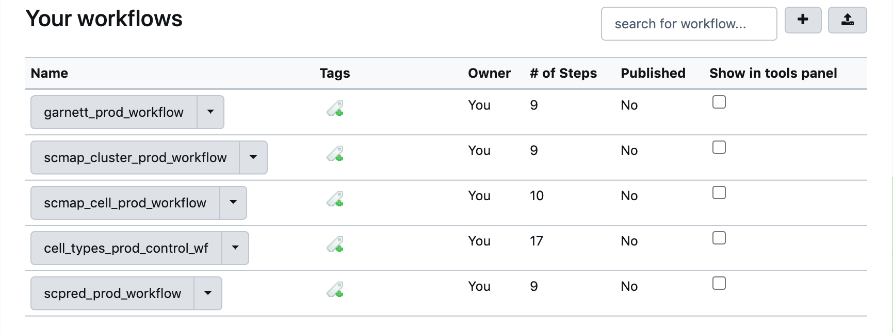
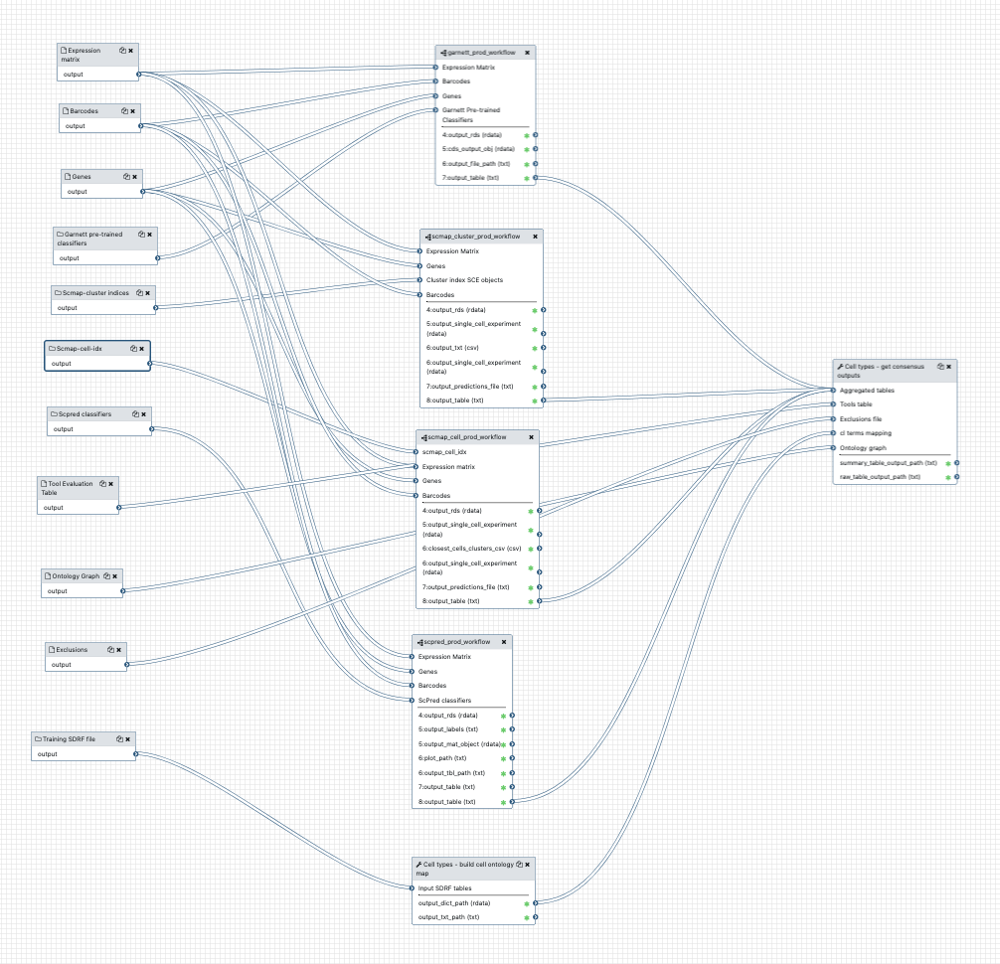
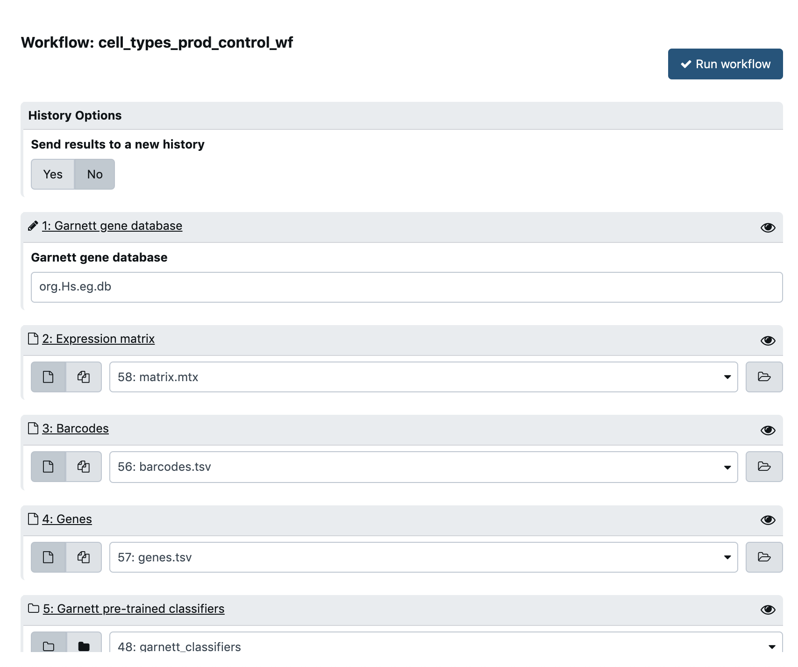
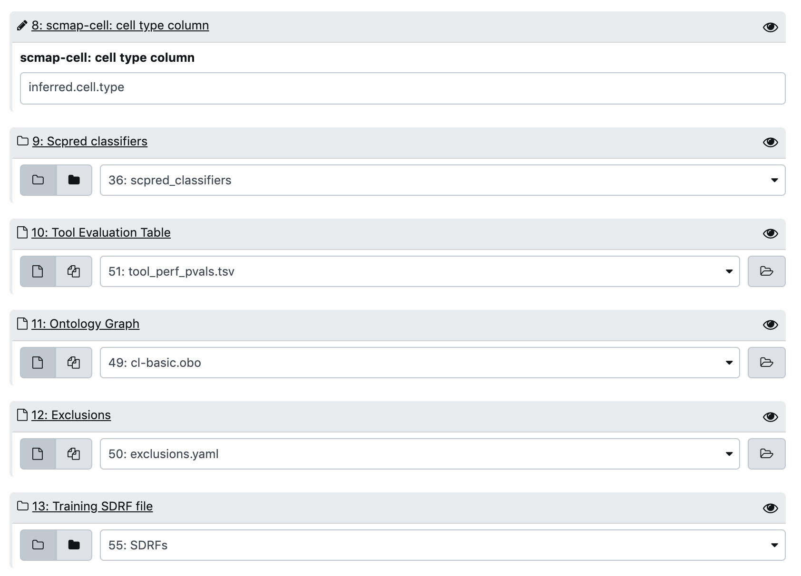

# Generating consensus predictions for single-cell RNA-seq cell types

## Objectives
This tutorial is designed to provide instructions on running the single-cell RNA-seq cell types prediction workflow in Galaxy.

## Introduction 
When a new, unlabelled scRNA-seq expression data becomes available, it is rarely annotated with cell types. Rigorous annotation requires domain-specific expertise that is not always available in the laboratories that generate the data. To address this problem, a variety of tools have been developed for computational classificetion of cell types. These tools employ a variety of statistical and mathematical methods. Naturally, each method has inherent advantages and drawbacks. 

This framework employs a widely-used strategy for data classification - it uses multpile tools to obtain predictions, combines them and generates a consensus output. More specifically, it runs novel data against multiple libraries of classifiers trained on existing datasets with high-quality annotations. Predictions for each cell are initially filtered based on tool-specific scores, followed by calculating the frequency of each candidate label as well as [semantic similarity](https://en.wikipedia.org/wiki/Semantic_similarity) across predictions. These metrics allow to ascertain the reliability and agreement of predictions. Finally, a table with 3 top candidate labels, corresponding metrics per cell and datasets of origin is produced. 

## What you will need
* Expression data in the format of 10X Genomics directory with the following files: 
    * `matrix.mtx` - gene-by-cell matrix holding expression data 
    * `genes.tsv` - list of genes (corresponding to rows of the matrix)
    * `barcodes.tsv` - list of cell IDs (matrix columns)
* Collection of pre-trained classifiers (generated by [this](https://github.com/ebi-gene-expression-group/cell-types-train-control-workflow) workflow) 
* Tool evaluation table (produced as output of [this](https://github.com/ebi-gene-expression-group/cell-types-eval-control-workflow) workflow; available [here](https://www.ebi.ac.uk/~a_solovyev/prod_testing_data/tool_perf_pvals.tsv))
* Cell Ontology graph in .obo or .xml format (available [here](https://www.ebi.ac.uk/~a_solovyev/prod_testing_data/cl-basic.obo))
* Exclusions file in `.yaml` format (needed to filer out unlabelled cells and trivial terms; see example [here](https://www.ebi.ac.uk/~a_solovyev/prod_testing_data/exclusions.yaml))
* SDRF files for training datasets (required to extract cell ontology terms)

## Configuring and running the workflow 
The workflow is run in Galaxy. Galaxy is a user-friendly service that provices a GUI for using bioinformatics methods. In your running Galaxy instance, open the workflow called `cell_types_prod_control_wf`. To be precise, this is a workflow-of-workflows that runs predictions from individual tools in a modular manner. It consists of the following child workflows: 
* `garnett_prod_workflow`
* `scmap_cluster_prod_workflow`
* `scmap_cell_prod_workflow`
* `scpred_prod_workflow`

The majority of key parameters are configurable at the level of the outer workflow, however, in cases when the individual tool parameters need to be modified, you can refer to the child workflows' configuration. 

To execute the workflow, press the `run` button on the top-right (view from the workflow editor). This will direct you to the configuration page, see Fig.3. 

1. `Garnett gene database` - name of Bioconductor database of genes used by Garnett tool (species-dependent: `org.Hs.eg.db` for H.Sapiens, `org.Mm.eg.db` for Mus Musculus, etc.)
2. `Expression Matrix` - matrix with expression data, as explained above
3. `Barcodes` - file with cell IDs 
4. `Genes` - file with gene IDs 
5. `Garnett pre-trained classifiers` - directory of classification models generated by classifier training workflow
6. `Scmap-cluster indices` - directory with scmap-cluster models
7. `Scmap-cell indices` - directory with scmap-cell models

8. `scmap-cell: cell type column` - Name of the cell type field in scmap-cell classifier (`inferred.cell.type` by default)
9. `Scpred classifiers` - Directory with Scpred models
10. `Tool evaluation table` - Table with combined tool scores
11. `Ontology Graph` - file with Cell ONtology graph 
12. `Exclusions` - yaml file with excluded terms (described above)
13. `Training SDRFs` - directory with SDRF files corresponding to training datasets

After all config parameters are set, hit the `Run Workflow` button in the top right to trigger workflow execution. 

## Results 
After the workflow is run, new entries will appear in the history on the right-hand side of the screen. The output table will be found under `Cell types - get consensus outputs` entry. 
