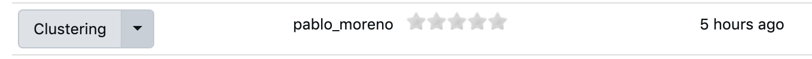
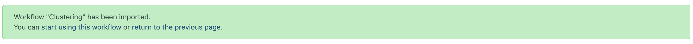
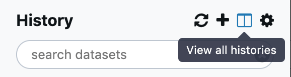
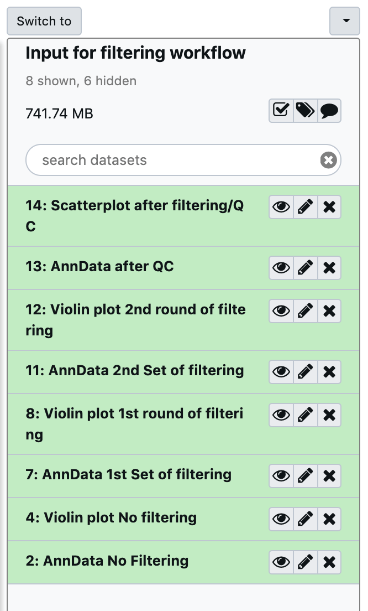
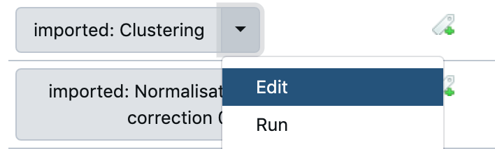
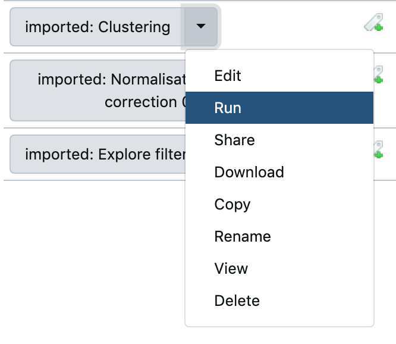
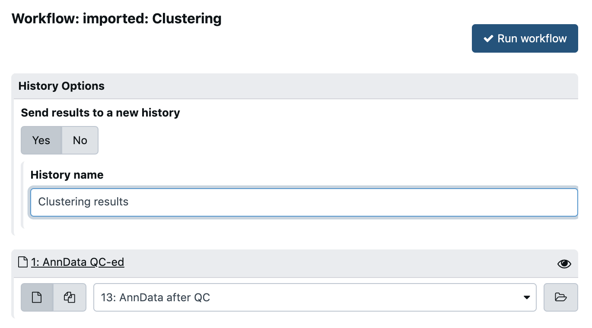
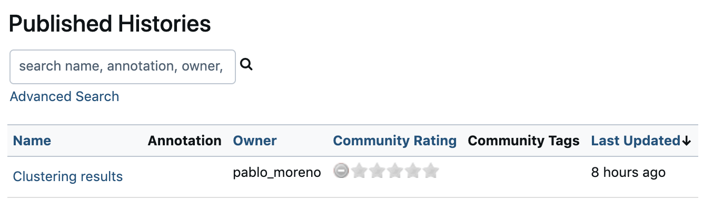

# Clustering tutorial

Following the same mechanisms in terms of Galaxy operation as we did in the previous tutorials, we will inspect now the clustering workflow.

## 3.1.- Import workflow and switch to history

As usual, go to `Shared Data -> Workflows`

and import the `Clustering` workflow.

Click on the link to start using it.

Your history panel should be showing you currently the output of the Normalisation part. We need to switch back
to the workflow that has the `AnnData QC-ed` dataset. This history is named `Input for filtering workflow`. To switch to this history go to the upper left corner of the window and press the `View all histories` button:

There you should see the desired history, click `Switch to` in the button above that history:

and then click on `Analyze Data` in the top menu. You should see `AnnData after QC` dataset in your history now.

## 3.2.- Inspect the workflow

Click on `Workflow` in the upper menu and select the `Edit` option for the `Imported: Clustering` workflow.

- What plots are we making? Could you think of additional plots that should be added?
- If you would need to change the clustering resolution of the workflow, where would you do that?
  - How would you modify the workflow to run with various different resolutions and assess their effects?
- Before you continue to ponder and explore these questions, go to the next point [3.3](#32--run-the-workflow) and set the original workflow to run.
- Increasingly people say that we shouldn't be doing scaling. How would you modify the workflow to test the effect of scaling or not?
  - If you want to give it a go, select `Save as` first through the cog icon  and save the new workflow with a different name with your changes (so that you can later run the original one for the subsequent part.)
  - **Hint:** Use the duplication  button on each tool of the workflow that you want to duplicate with the same settings.
- Is there any marker gene plot that we could add? Explore the `Plot with Scanpy` module and see if there is something else that you can add.
- Is the Filter Genes step running with the latest version of the tool? Can you discover how you can find that out?
  - Hint: Click on the tool in the canvas, and then inspect the upper part of the Details, there are a few buttons there.

The above questions are ideas for you to explore, you are welcomed to pursue your own ideas in the workflow and modify it.

## 3.3.- Run the workflow

Click on `Workflow` in the upper menu and select the `Run` option for the `Imported: Clustering` workflow.

Make sure that the input is set to the `AnnData after QC` object, set `Send results to a new History` to `Yes` and name the new history `Clustering results`.

Then once the 17 steps are loaded loaded below, press `Run Workflow`. You can either go to the new history created or if you were considering some of the ideas of point [3.2](#32--inspect-the-workflow) you can go back to that while the workflow runs.

## 3.4.- Inspect the workflow results

Using the `View all histories` button  select the history that contains the results `Clustering results` (press `Switch to` and then come back by clicking on `Analyze Data`).

In case that your workflow execution had failures, you can see the results by importing the `Clustering results` from the `Shared Data -> Histories` part.

In the history (either your results or the imported one) inspect the different UMAP and PCA plots.

Can you tell a difference between the normalised results used in the previous practical? Can you spot any substantial difference in terms of the steps after QC?
