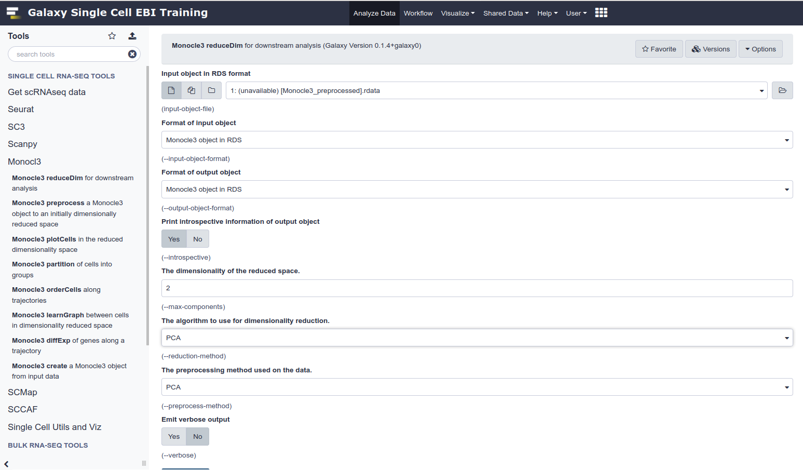
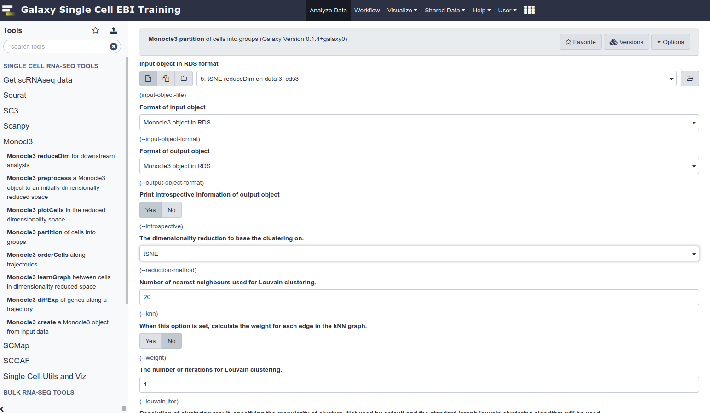
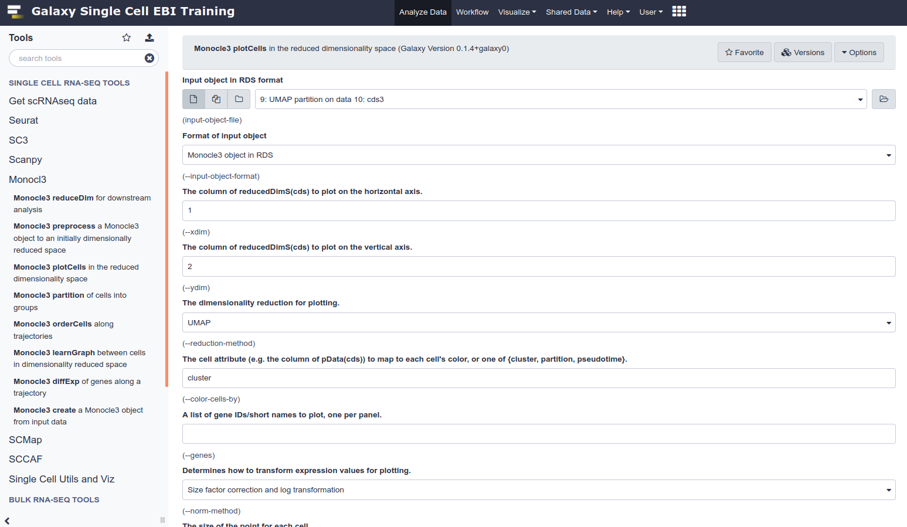
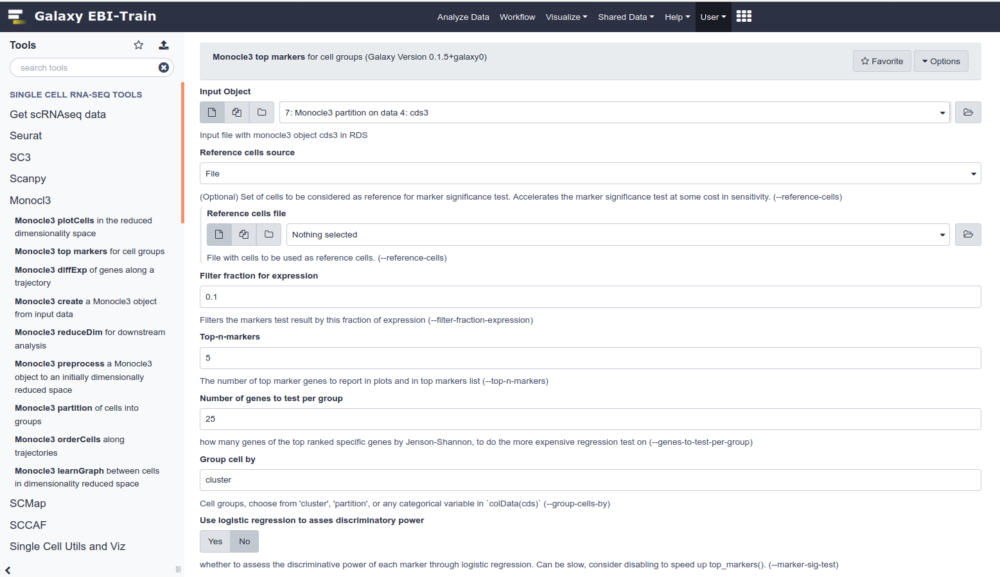
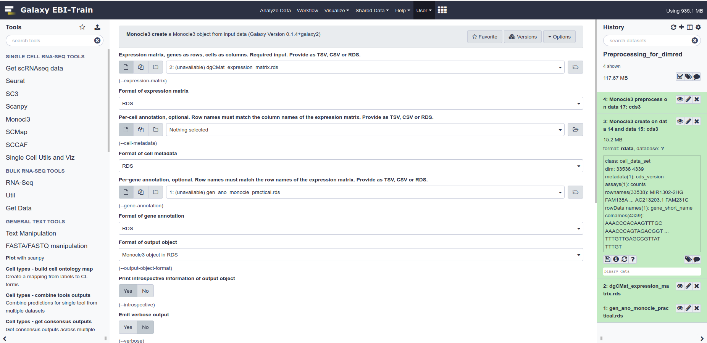
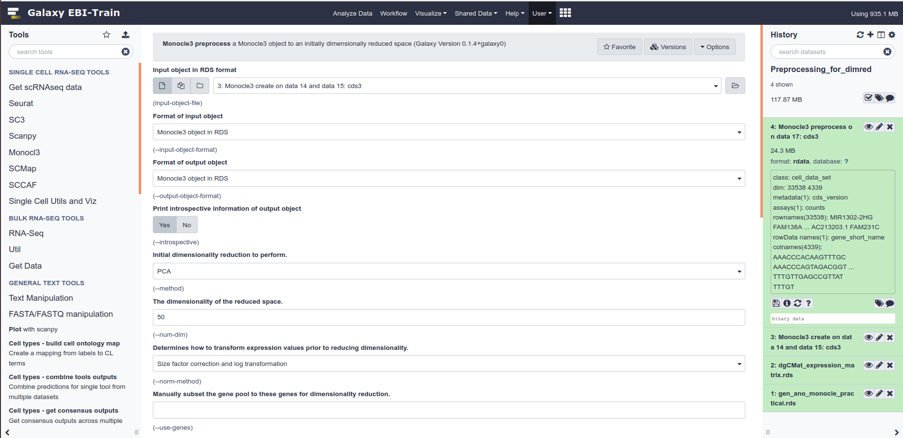

## Single-cell RNA-seq clustering and dimensionality reduction 

The goal of this exercise is to use different dimensionality reduction methods for visualisation and clustering.

The data example is [5 000 peripheral blood mononuclear cells](https://support.10xgenomics.com/single-cell-gene-expression/datasets/3.1.0/manual_5k_pbmc_NGSC3_ch1) It should be already loaded and preprocessed at the start of your Galaxy history.

## Exercise

For each of PCA, tSNE and UMAP, perform the following steps:

 * dimensionality reduction
 * clustering
 * visualisation
 
Compare the results.

 * What are key differences between the plots?
 * How many clusters are generated?
 * Can you think of cases where one of the visualisations would be a better choice?

Afterwards you will see top markers assigned to each of the cluster. Can you recognise any cell types from the top markers?

## Dimensionality reduction

Use **Monocl3 reduceDim** tool under **Monocl3** section.
Use the initial prepared data as input and select a dimensionality reduction algorithm (PCA, tSNE or UMAP)

## Clustering

Use **Monocl3 partition** tool under **Monocl3** section.
Use the result of the dimensionality reduction as input and select the same dimensionality reduction.

## Generating plots

Use **Monocl3 plotCells** tool under **Monocl3** section.
The input is the result of the clustering step.
Select the appropriate dimensionality reduction and set cell attribute to "cluster".

## Marker identification

Use **Monocl3 top markers** tool.
The input is the result of the UMAP clustering step. It will not work with other types.
It will execute well just with the default options, but you can change the number of top markers per cluster to be listed, genes to be tested and the fraction of cells that need to be expressing a gene in order for it to be considered.

Once you launch it, it will start 2 jobs - one with a table as a result and the other with the corresponding plot as a result.

## Plotting specific markers

You can use the **Monocl3 plotCells** tool to plot the expression levels of a specific gene.
As the input use the UMAP clustering. Put the name of a gene in the gene ID cell.

Check out some markers from the previous step that seems interesting!

## Preprocessing (optional)

If you have data you would like to use as input to the pipeline above, the preprocessing pipeline is currently located at the EBI-Train server [here](http://abe5e379298d911eab9d206123280b5c-1797082729.eu-west-2.elb.amazonaws.com/u/vladimir/h/preprocessingfordimred).

The raw data you need for it is a count matirx - expression of genes by cells, and an annotation data frame in R made of a column of gene names. Both of those should be found within this repository.

First you must create the Monocle object with **Monocl3 create**.
The inputs are the expression matrix file and the gene annotation file.
If there is cell metadata you would like to add, you can add that information too.

Use the **Monocl3 preprocess** on the resulting object.
You can change the number of principal components it uses in order to speed it up or reduce the memory size, but normally that isn't ecessary.

