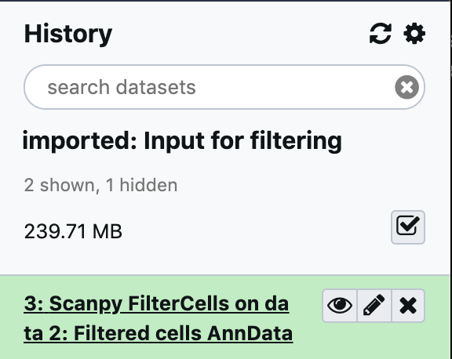
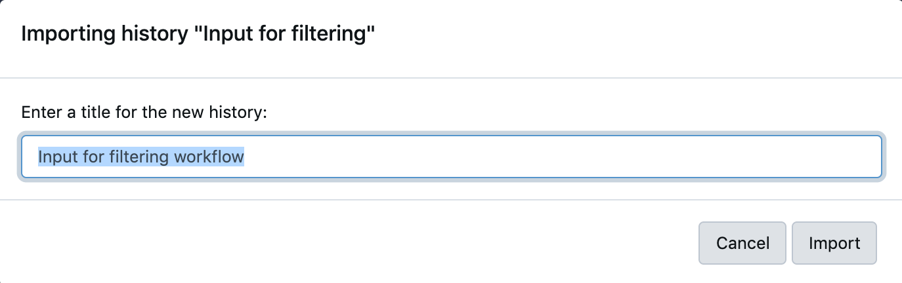
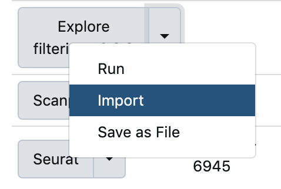
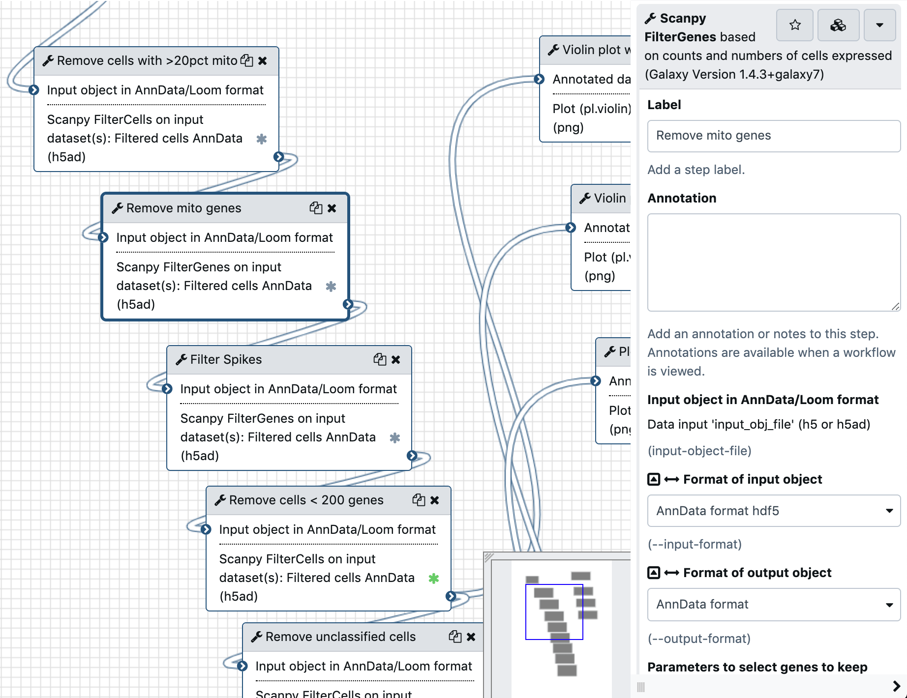

# Filtering, normalisation and batch correction practical

# 1.- Filtering

## 1.1.- Explore and get data to filter

Explore the main filtering tools available, you can find them by searching at the top left on top of the Tools panel for
`filtercells` and `filtergenes`:

Click on Scanpy FilterCells tool. If you scroll down you will see the numerical parameters box in the main panel:

You can add more filtering boxes for other numerical variables and categorical (including booleans) variables. You can also add
values (like a list of gene names) through a file.

**Note:** To do filtering on AnnData objects is useful to understand the format itself; what are the observations and what are the
variables. You can find out more at the [AnnData documentation](https://anndata.readthedocs.io/en/stable/) or at the help of the
`Inspect AnnData` tool (search for it as you did for filter cells or filter genes).

# 1.1.1.- Import history for filtering

To try the tool import the history called `Input filtering` available through `Shared data -> Histories` (at the top centre, above the main panel):

Click on the History name and then click on the import button:

Leave the same name as proposed in the dialog and press `Import`.

## 1.2.- Filter to keep only cells with up to 20% counts of mitochondrial genes

Now search again for the tool `filtercells`, click on `Scanpy FilterCells` and the input should be set to `AnnData No filtering`.
This file was generated from 10x formatted files obtained from Expression Atlas [E-MTAB-5061](https://www.ebi.ac.uk/gxa/sc/experiments/E-MTAB-5061/results/tsne)
using the Workflow `Read data and transform metadata` available in the `Shared data -> Workflows`. These 10x formatted files are
what you would generate by the process explained in the Quantification module earlier on the Generation of an expression matrix module.

In the workflow used to generate this file (`Read data and transform metadata`) the genes that belong to the Mitochondria were tagged
in a boolean category called `mito` and for each cell the percentage of counts belonging to those genes was computed and left in
the `pct_counts_mito` AnnData observation field. We will use this to filter our input.

After clicking again on the `Scanpy FilterCells` tool in the tool's panel to the left, and making sure that the input is the desired one:

scroll down in the main panel where the tool is shown to `Parameters to select cells to keep`, there write (replacing the current content) `pct_counts_mito`, and the min and max values shown.

and scroll down to find the blue `Execute` button and press it.

An item should appear in your history panel to the right, first grey waiting to be sent and then orange while executing. After a short while you should have a new item in the history:

Click on the name to expand it, you should see a summary

which tells you that the data set has now 2843 cells and 27427 genes (the original object was 3200 cells × 27427 genes,
you can find this out or more by using the `Inspect AnnData` tool with the original input on the history).

## 1.3.- Remove all mitochondrial genes

Locate the tool `Scanpy FilterGenes`, set as input the output of the previous step (which is called something
like `Scanpy FilterCells on data x: Filtered cells AnnData`) and then scroll down to the
`Categories to select genes to keep (unless negate is checked)` part, add one of those sections pressing the underlying plus button
and fill it like this:

Make sure that the force recalculation of QCs is set to `Yes` at the bottom.

Then scroll down and press Execute. How many genes did we get rid off now?

## 1.4.- Visualise changes

There are better ways of checking how the dataset changes than checking the summary of the tool in the History panel.
Search on the tool panel search at the top for `Plot Scanpy` and select the tool `Plot with Scanpy`.

Select the dataset that you want to inspect and then select `Violin Plot` from the type of plot:

Set the keys for accessing variables to

and input in the text field `n_counts,n_genes,pct_counts_mito`.

Then scroll down to the `Violin plot attributes`

and set `Display keys in multiple panels` to `Yes`, as shown above.

Scroll down to the Execute button and press it... Ooops. An error.

Click on the name of the result to expand it, and then go down to find the `i` (for Info) button and click it.

This view in the main panel gives you information about the job, and might tell you something that as a user you might be able to change to make
the job work (sometimes there can be conflicting parameters or certain parameters trigger a bug, and sometimes there is not much that you can do as a user).

You can see output and errors of this job by clicking in `stdout` and `stderr` within the Job Information section:

In this case the `stderr` tells us that:

> ValueError: Colormap default is not recognized.

This is a bug in the tool, but can be circumvented by picking another color.

Go back to the red item showing the failure in the History panel, and click the `Run this job again` button with the circled arrows:

This will show you the tool with all the previous settings that you used, including the same input.

Scroll nearly to where the Execute button is and you will find the section

Click on it to expand it, inside you will find the parameter `Colors to use for the different levels of the hue variable`, which is set to `Default`.

Change it to any other color and press `Execute` again, this should fix the issue.

Once done, click on the `Eye` button in the resulting green dataset, you should get something like this on the main panel:

**Bonus:** try the same plotting on your initial dataset to see if there is any appreciable changes.

**Hint:** to reduce the number of settings that you need to manually adjust, press the `Run this job again` button in the last successful
execution and simply change the input object in the main panel.

## 1.5.- Running a workflow

As you noticed, running only a few tools required a lot of manual setting up and clicking. When you have an idea of what you want to do and you need to run it many times, it is useful to create a workflow with all the steps. To showcase the steps presented in the theory part of Filtering and Normalisation we have created a workflow with all the steps and with some associated plotting.

## 1.6- Start from a clean history

Import again the history for filtering as explained in point `1.1.1`,
this time changing the name to `Input for filtering workflow` so that you can tell it apart from the previous import.

## 1.7.- Import and run workflow

Go to `Shared Data` at the top of the main panel and select `Workflows`.

There look for `Explore filtering v0.2.8`

and press the triangle to the side to choose `Import`.

You should see this:

Click on `Start using this workflow`

Then again to the right of the workflow select `Run` (we will inspect it while it runs).

If you are standing in the correct history (the one we just imported called `Input for filtering workflow`), you should see `AnnData No filtering` as the input:

If the file is not selected, click on the drop down and find it. If you are in the wrong history, try to find the correct history (`Input for filtering workflow`) or ask for help.

It might take a short while to load all the tools that it is using (13 of them) in the lower part. Once you see the last tool `13: Plot` at the end

press the blue `Run workflow` at the top right of the central panel. You should see this in the central panel

and new results in progress of being generated will start showing up in your history.

## 1.8.- Explore the workflow

Click on `Workflow` in the main menu on top of the central panel.

and in the recently imported workflow, select `Edit` in its drop down menu:

You will see the workflow canvas with your imported workflow:

You can explore the workflow by dragging on the reticulated background or by moving the blue square inside the zoomed out view
at the bottom right of the main panel.

Each box is a tool that it is being executed, with the tools passing
results to the following tools via the connections. Click on each tool
to see what is the tool doing. When you do so, the right panel will show the details of the tool, with all the parameters preset for that tool in that step of the workflow.

You will find both filtering steps (for cells and genes) and plotting steps. Each step with the green asterisk will be shown in the results of your execution (in the history). Make sure that you understand what we are filtering in each step, so that looking at the plots makes sense later.

Notice after which steps we are doing plots and what type of plots. Click on the tool boxes in the canvas for more information.

## 1.9.- Go back to the workflow results

Hopefully by now your execution of the workflow should be done. In the main menu click on `Analyze Data` (you can discard or save any changes that you did to your workflow).

Your history should look like this

You can explore each of the plots (the more at the top they are they tend to be later results in the process) by clicking on the `Eye` icon of each history entry. Note that not all results are plots, and clicking on the `Eye` button might trigger a download (if it is an AnnData object, which Galaxy doesn't know how to show). If for whatever reason any of your History items look red, ask for help.

If your history doesn't have among the green results

or if one of your plots didn't work, please import the history with
the filtering results: `Shared Data -> Histories` (see part `1.1.1` if you don't remember the process) and use the proposed history name.

# 2.- Normalisation & batch correction

## 2.1.- Import the workflow and run it

Import the workflow named `Normalisation and batch correction v0.2.8`, you can follow instructions at the beginning of point `1.7` if needed. Making sure that your active history (what you see in the history panel) contains a result in green named `AnnData after QC`

select `Run` in the drop down menu for the workflow. In the next screen, this time make sure that the results are left in a new history by clicking on `Yes` for `Send results to a new history`.

Name the new history `Normalisation and batch correction 0.2.8 results`. Make sure, as shown above, that the input to the workflow is the `AnnData after QC` file. Once you see that the 18 tools are loaded below, press `Run workflow`.

Switch to the newly created history by clicking on the link of the next screen:

Results should start to pile up in the history. In the meantime, explore the workflow to understand what is doing.

## 2.2.- Explore the workflow

Explore the workflow following the same directions as in part `1.8`,
but this time of course with the `imported: Normalisation and batch correction 0.2.8` workflow.

- Why does the workflow has 3 branches?
- Explore the order of the steps and what is being done in them.
- Do you notice anything missing?
- Look at from which steps the plots are generated and think of which ones would you like to compare later on.

## 2.3.- Explore the results

Go back to the history (we would expect the results to be there in around 10 minutes since execution start) by pressing on `Analyze Data` at the top of the main panel. Ideally your history should look all green now.

Compare the plots with and without normalisation and batch correction. If your history doesn't have the results, you can import
the history named `Normalisation and batch correction 0.2.8 results` from the `Shared Data -> Histories` in the main menu.

# Delete histories

As you might have noticed, each history accumulates a reasonable amount of data, partly because the objects are copied at each step. Once you are done with the history, you can delete it by clicking on the cog above the active history and selecting `Delete permanently`.

Please keep the filtering results history (either imported or with your results), as it will be used as input in the Clustering part.
