# Generating an expression matrix for droplet single-cell RNA-seq (dscRNA-seq) data

## Objectives

By the end of this short tutorial should you should understand:

 * how to generate an expression matrix from droplet-based single-cell transcriptomic data.                               
 * how to do some basic quality control
 * how to pass the matrix for downstream analysis

## You will need

 * A fastq file containing cell barcode and unique molecular identifiers (UMIs)
 * A matching fastq file containing biological sequences (cDNAs)
 * A reference transcriptome to map against
 * Necessary information to generate a transcript-to-gene mapping

We'll be using pre-prepared example inputs

# Introduction

This session will show you the principles of the initial phase of single-cell RNA-seq analysis: generating expression measures in a matrix. We'll concentrate on droplet-based (rather than plate-based) methodology, since this is the process with most differences with respect to conventional approaches developed for bulk RNA-seq.

Droplet-based data consists of three components: cell barcodes, unique molecular identifiers (UMIs) and cDNA reads. To generate cell-wise quantifications we need to:

 1. Process cell barcodes, working out which ones correspond to 'real' cells, which to sequencing artefacts, and possibly correct any barcodes likely to be the product of sequencing errors by comparison to more frequent sequences.
 2. Map biological sequences to the reference genome or transcriptome.
 3. 'De-duplicate' using the UMIs.

This used to be a complex process involving multiple algorithms, or was performed with technology-specific methods (such as 10X's 'Cellranger' tool)  but is now much simpler thanks to the advent of a few new methods. When selecting methodology for your own work you should consider:

 * [STARsolo](https://github.com/alexdobin/STAR) - a dscRNA-seq-specific variant of the popular genome alignment method STAR. Produces results very close to those of Cellranger (which itself uses STAR under the hood).
 * [Kallisto/ bustools](https://www.kallistobus.tools/) - developed by the originators of the transcripome quantification method, Kallisto.
 * [Alevin](https://salmon.readthedocs.io/en/latest/alevin.html) - another transcriptome method developed by the authors of the Salmon tool.

We're going to use Alevin for demonstration purposes, but we do not endorse one method over another.

We'll be using a setup based on Galaxy to illustrate the process for teaching purposes, but all steps are peformed using commodity tools you could run from the command line if you're more comforable there. The logical process we'll be executing is relatively simple given currently available tools, but there are some complexities we'll explain.  

## 1. Example data

We've provided you with some example data to play with, a small subset of the reads in a human dataset of lung carcinoma (see the study in Single Cell Expression Atlas [here](https://www.ebi.ac.uk/gxa/sc/experiments/E-MTAB-6653/results/tsne) and the project submission [here](https://www.ebi.ac.uk/arrayexpress/experiments/E-MTAB-6653/)). This is a study using the 10X 'v2' chemistry.

Down-sampled reads and some associated annotation are provided for you in what Galaxy calls a 'history'. Access the shared history:

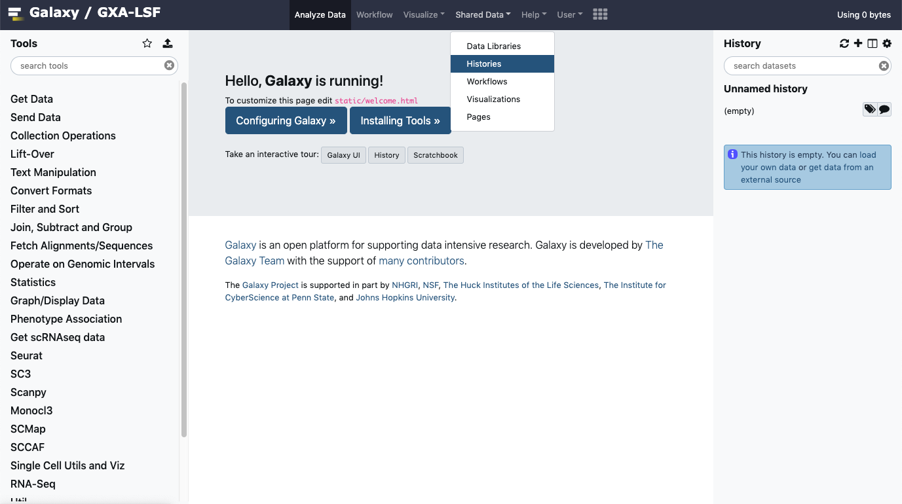

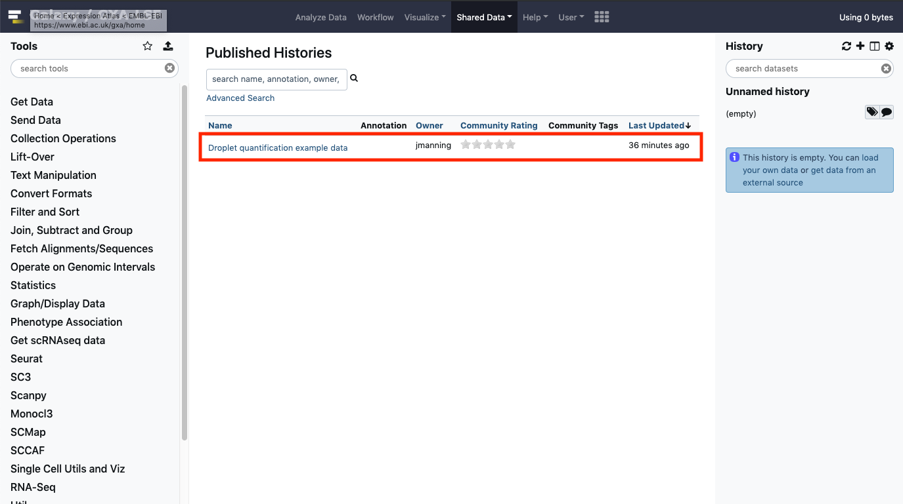

If you click through to the history itself, you'll see that we've provided you with two 1 million-read FASTQ files, a transcriptome in FASTA format and GTF files related to the gene annotations and to a set of spike-ins. You can then import the history to use yourself:

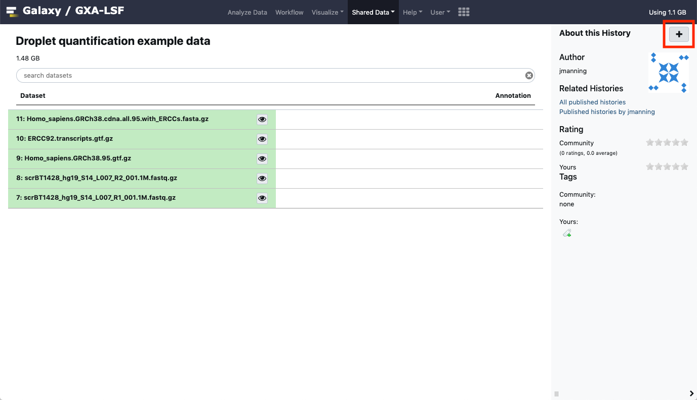

This is what the your history will look like:

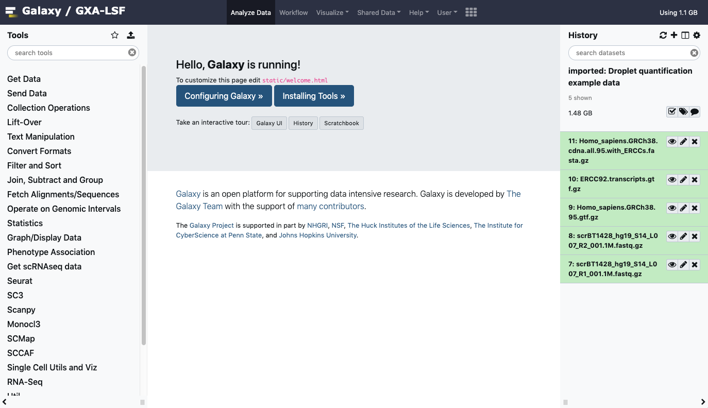

> EXERCISE: Have a look at the files you now have in your history. Which of the FASTQ files do you think contains the barcode sequences? Given the chemistry this study should have, are the barcode/UMI reads the correct length? (hint: check https://teichlab.github.io/scg_lib_structs/methods_html/10xChromium3.html)

## 2. The workflow

Alevin collapses the steps involved in dealing with dscRNA-seq into a single process, so much of what we'll cover is 'plumbing' of inputs, and interpretation.  

### 1. Generate a transcriptome index

Tools such as Alevin need to compare the sequences in your sample to a reference containing all the likely transcript sequences (a 'transcriptome'). This will contain the biological transcript sequences known for a given species, and perhaps also technical sequences such as 'spike ins' - more on that later.  

To be able to search a transcriptome quickly, Alevin needs to convert the text (FASTA) format sequences into something it can search quickly, called an 'index'. The index is in a binary rather than human-readable format, but allows fast lookup by Alevin. Because the types of biological and technical sequences we need to include in the index can vary between experiments, and because we often want to use the most up-to-date reference sequences from Ensembl or NCBI, we can end up re-making the indices quite often. But the process is a little bit time-consuming, so we'll use pre-made indices for this session where possible. Nevertheless, have a look at the fasta format sequences provided, which are the same as the ones we used to build the index.   

### 2. Generate a transcript to gene mapping

Gene-level, rather than transcript-level, quantification is standard in scRNA-seq, which means that that the expression level of alternatively spliced RNA molecules are combined to create gene-level values. droplet-based scRNA-seq techniques only sample one end each transcript, so lack the full-molecule coverage that would be required to accurately quantify different transcript isoforms.  

To generate gene-level quantifications based on transcriptome quantification, Alevin and similar tools require a conversion between transcript and gene identifiers. We can derive a transcript-gene conversion from the gene annotations available in genome resources such as Ensembl. The transcripts in such a list need to match the ones we used when we built the transcriptome index. The study we're working with here added spike-ins to their samples, so when we created the index above in preparation for this tutorial, we combined sequence information for the biological sequences as well as the ERCC spike-ins. So now we need to generate a transcript to gene mapping with both types of sequence.

In your example data you will see 'Homo_sapiens.GRCh38.95.gtf.gz', which is the human reference annotation as retrieved from Ensembl in GTF format. This annotation contains gene, exon, transcript and all sorts of other information on the sequences. In the example data, you will also see the annotations for the ERCC spike-ins (also in GTF format). We will use these to generate the transcript/ gene mapping, first by combining the two types of general annotation and second by passing that information to a tool that extracts just the transcript identifiers we need:

Find the 'concatenate' tool in Galaxy under 'Text Manipulation':

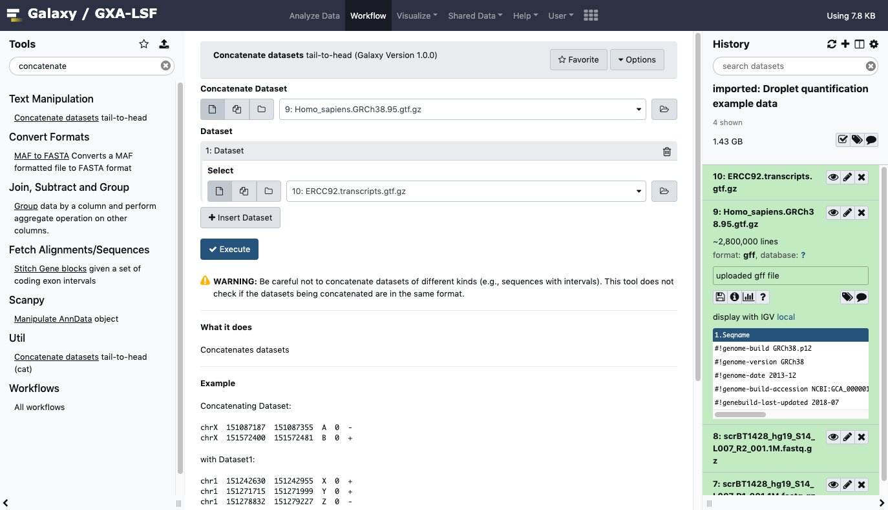

Select biological and spike-in sequences from your history, and use them as inputs. Run the tool and generate your combined annotations.  
> EXERCISE: Which of the 'attributes' in the last column of the GTF files contains the transcript and gene identifiers? Hint: The file is organised such that the last column (headed 'Group') contains a wealth of information in the format: attribute1 "information associated with attribute";attribute2 "information associated with attribute 2" etc.

Now we have combined annotations, we can parse the GTF file using the [rtracklayer](https://bioconductor.org/packages/release/bioc/html/rtracklayer.html) package in R. This parsing will give us a conversion table with a list of transcript names and their corresponding gene names for counting. We've made a convenience tool in Galaxy to wrap that functionality for you- search for 'GTF2GeneList':

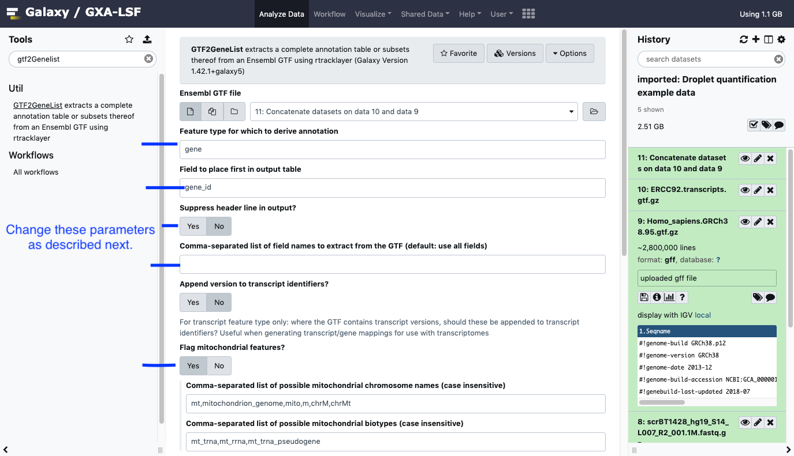

This tool is designed to do a variety of things. For our purposes parameterise like:

 * "Feature type..." : transcript        
 * "Field to place first..." : (use the attribute you identified above for the transcript)
 * "Suppress header" : yes
 * "Comma separated list of field names" : (transcript attribute),(gene attribute)
 * "Append version to transcript identifiers" : yes
 * "Flag mitochondrial features" : no

> EXERCISE: compare the transcript identifiers you'll find in the FASTA file you were given at the start with the transcript ID values in the GTF, to see why we say 'yes' to the 'transcript identifiers' question. Note that 'version' here refers to the number of times the reference has been edited.

### 3. Running quantification

Now we have everything we need to run Alevin:

 * A Salmon index for our transcriptome (transcript name or identifier & sequence)
 * Barcode/ UMI reads
 * cDNA reads
 * transcript/ gene mapping

We can now run Alevin. Locate the tool by searching with the 'search tools' box. In some public instances, it won't show up if you search for it. Instead, you have to click the Single Cell tab at the left and scroll down to the Alevin tool. Tip: Make sure that the Alevin tool version you are using is this: (Galaxy Version 0.14.1.2+galaxy1) - it should be default. If not, click 'Versions' and choose that version.   

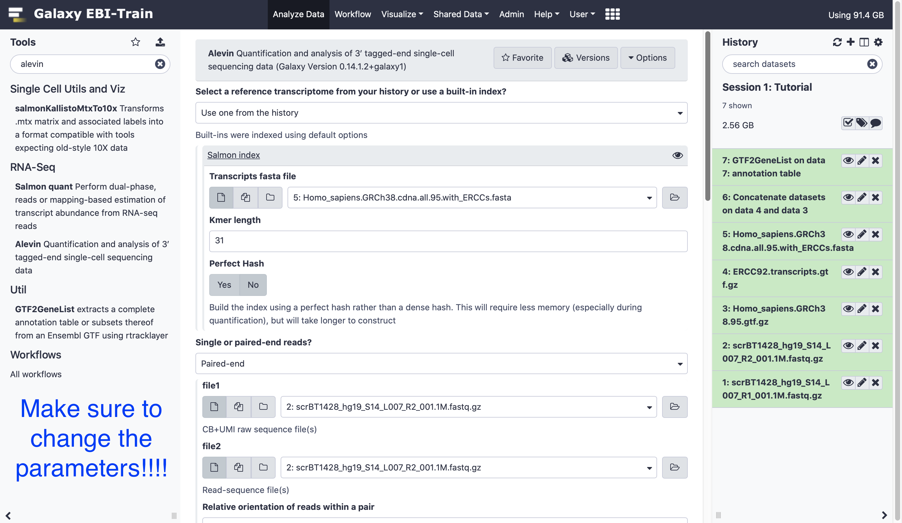

> EXERCISE: Using what you know of this analysis and this protocol, try to determine the correct library options yourself for the following parameters:
 * file1
 * file2
 * specify the strandedness (the Salmon documentation on 'Fragment Library Types' and running the Alevin command (https://salmon.readthedocs.io/en/latest/library_type.html and https://salmon.readthedocs.io/en/latest/alevin.html) will help here, although keep in mind the image there is drawn with the RNA 5' on top, whereas in this scRNA-seq protocol, the polyA is captured by its 3' tail and thus effectively the bottom or reverse strand...)
 * protocol
 * Transcript to gene map file
Additionally, do select:
 * Select a reference transcriptome: Built-in index if available (building one from the history transcriptome will take a while!)
 * Retrieve all output files
(Look in optional commands)
 * dumpFeatures: Yes
 * dumpMTX: YES
Many options can be left unset.
Now, run Alevin to produce a matrix market format (MTX) format output.

Because we're only using a million or so reads Alevin will run quickly and finish within a few minutes. Alevin produces many file outputs not all of which we'll use. You can refer to the [Alevin documentation](https://salmon.readthedocs.io/en/latest/alevin.html) if you're curious what they all are, but we're most interested in the matrix itself (quants_mat.mtx.gz - the count by gene and cell), the row (cell/ barcode) identifiers (quants_mat_rows.txt) and the column (gene) labels (quants_mat_cols.txt).  

> EXERCISE: Once you've run Alevin, look through the files and see if you can find: 1) the mapping rate 2) how many cells are present in the matrix output.

** Make certain to use _ quants_mat.mtx.gz  _ and NOT _ quants_tier.mtx.gz _ going forward. **  

### 4. Basic QC with barcode rank plots

Congratulations- you've made an expression matrix! We could almost stop here. But it's sensible to do some basic QC, and one of the things we can do is look at a barcode rank plot.

The question we're looking to answer here, is: "do we have mostly a have a single cell per droplet"? That's what experimenters are normally aiming for, but it's not entirely straightforward to get exactly one cell per droplet. Sometimes almost no cells make it into droplets, other times we have too many cells in each droplet. At a minimum, we should easily be able to distinguish droplets with cells from those without.   

Locate the barcode rank plot tool by searching for it in the search box.
 * Input MTX: No
 * Select the 'raw_cb_frequencies.txt' file you should have in your history from running Alevin. If you do not, then you didn't select 'dumpFeatures' when you ran Alevin- so go back and try again.
 * Set a plot title if you wish - good practice! - but leave other options at defaults.   

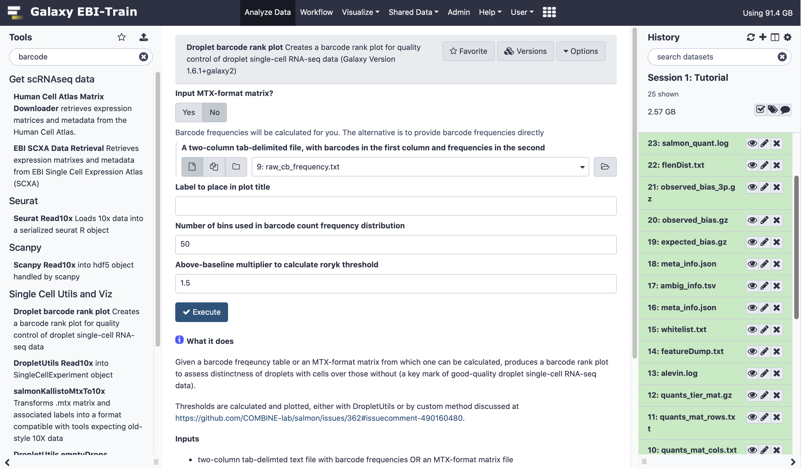

You'll end up with a plot like:

This is our own formulation of the barcode plot based on a [discussion](https://github.com/COMBINE-lab/salmon/issues/362#issuecomment-490160480) we had with community members. The left hand plot is the main one, showing the UMI counts for individual cell barcodes ranked from high to low. We expect a sharp drop-off between cell-containing droplets and ones that are empty or contain only cell debris. The right hand plot is a density from the first one, and the thresholds are generated either using [dropletUtils](https://bioconductor.org/packages/release/bioc/html/DropletUtils.html) or by the method described in that discussion. We could use any of these thresholds to select cells, assuming that anything with fewer counts is not a valid cell. By default, Alevin does something similar, and we can learn something about that by plotting just the barcodes Alevin retains. Go back and re-run the droplet barcode plot, this time selecting:
 * MTX input (quants_mat.mtx.gz).
 * You will need to select the option to assume cells are by row (more on that later).    

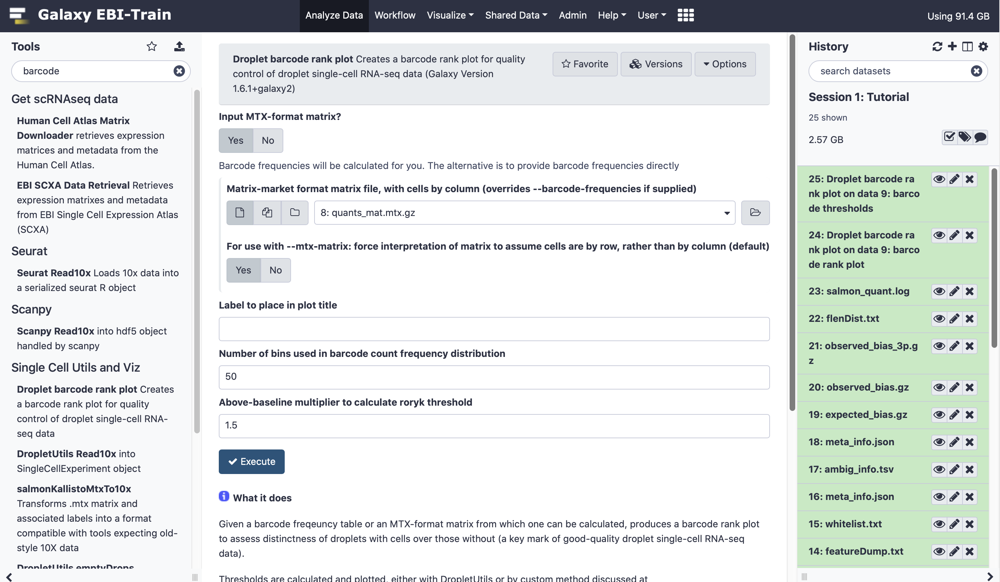

This will use the actual cell counts produced in Alevin's outputs to make the plot. The output will be like:

You should see a completely vertical drop-off where Alevin has trunctated the distribution (after excluding any cell barcode that had <10 UMI, Alevin then chose a threshold based off the curve and removed all barcodes with fewer UMIs).

In experiments with relatively simple characteristics, this 'knee detection' method works relatively well. But some populations present difficulties due to sub-populations of small cells that cannot be distinguished from empty droplets based purely on counts by barcode. Some libraries produce multiple 'knees' for multiple sub-populations. The [emptyDrops](https://genomebiology.biomedcentral.com/articles/10.1186/s13059-019-1662-y) method has become a popular way of dealing with this. emptyDrops still retains barcodes with very high counts, but also adds in barcodes that can be statistically distinguished from the ambient profiles, even if total counts are similar.

## 5. Apply emptyDrops to remove empty cells

To use emptyDrops effectively, we need to go back and re-run Alevin, stopping it from applying it's own thresholds. If you look under 'optional commands' you will see:
 * keepCBFraction: Set this to 1 to retain all cell barcodes.
 * freqThreshold: 3: this will only remove cell barcodes with a frequency of less than 3, a low bar to pass but useful way of avoiding processing a bunch of almost certainly empty barcodes. Trigger the Alevin re-run.

> EXERCISE: How many cells are in the output now?

Alevin outputs MTX format, which we can pass to the dropletUtils package and run emptyDrops. Unfortunately the matrix is in the wrong orientation for tools expecting files like those produced by 10X software (which dropletUtils does). We need to 'transform' the matrix such that cells are in columns and genes are in rows. We've provided you with a tool for doing this, search for 'salmonKallistoMtxTo10x':

Run this tool, supplying the inputs specified (make sure you don't mix files from different Alevin runs). The output will be a matrix in the correct orientation to pass to the next step.  

emptyDrops works with a specific form of R object called a SingleCellExperiment. We need to convert our transformed MTX files into that form, using the DropletUtils Read10x tool:

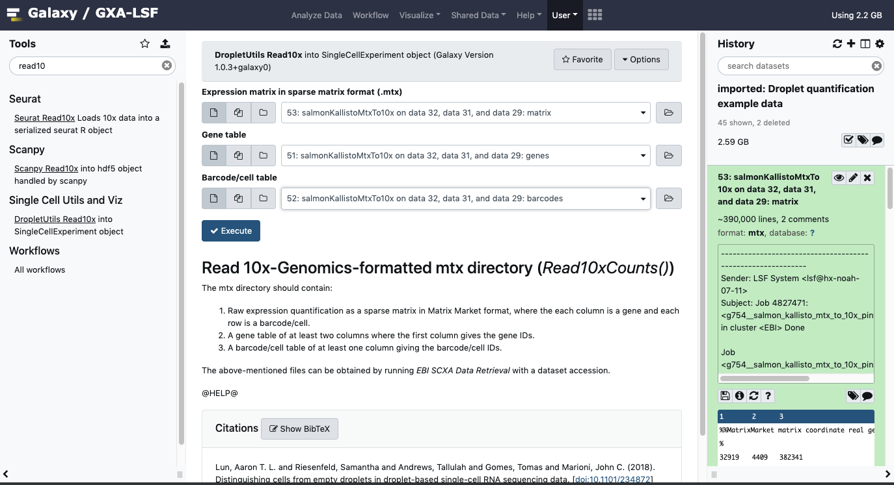

Now we have the data in the right format, we can run emptyDrops. Search for it with the tools search box:

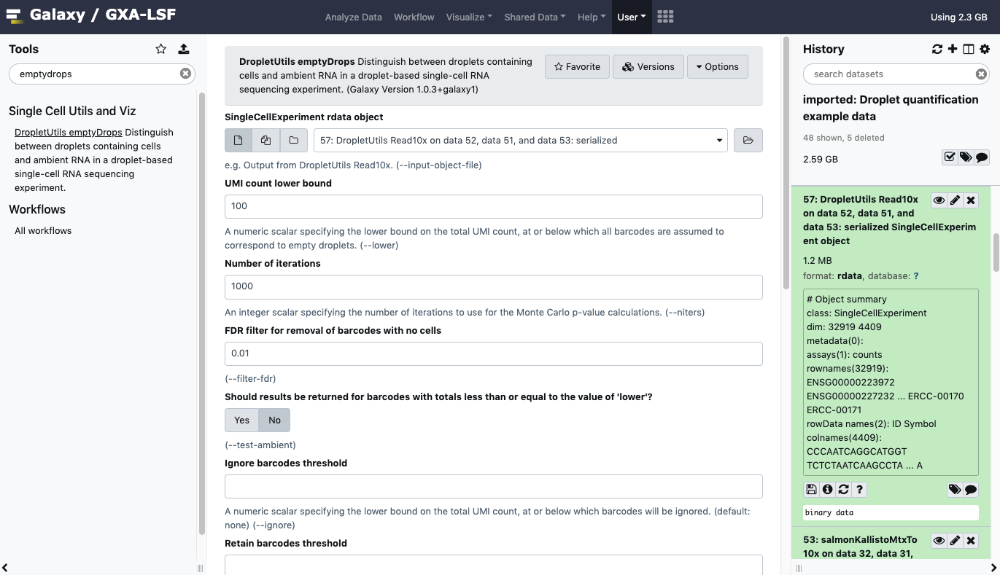

 * Be sure to select 'yes' when asked 'Should barcodes estimated to have no cells be removed from the output object?'.

> EXERCISE: how many cell barcodes remain after the emptyDrops treatment? Why might that be? (hint: is this a real/ complete set of data?). Go back and tweak parameters, re-running the tool.  

Assuming you've completed the last exercise, you have an expression matrix ready to go, in the SingleCellExperiment format of R. The other trainers will mostly be using a tool called Scanpy. They won't be using these dummy data, but if you wanted to pass this matrix to that tool, you would need to convert to a format called annData, which is a variant of a file format called hdf5. To help you with this we've provided you with a tool called sceasy:

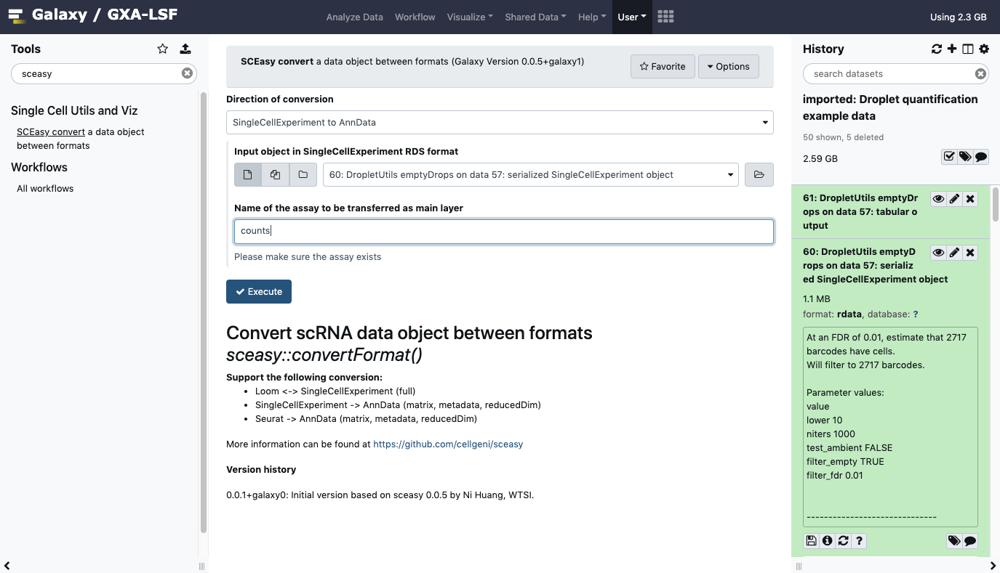

If you use the options as selected in the image above, you will have an annData object with raw data, ready to be passed to downstream analysis with Scanpy.

# 6. Running the whole workflow

In real life we do not run through analysis steps piecemeal as above, we run workflows in an automated manner. A complete workflow composed of the above steps is available to you via 'Shared Data' -> 'Workflows', labelled 'Droplet Quantification and preprocessing'.  

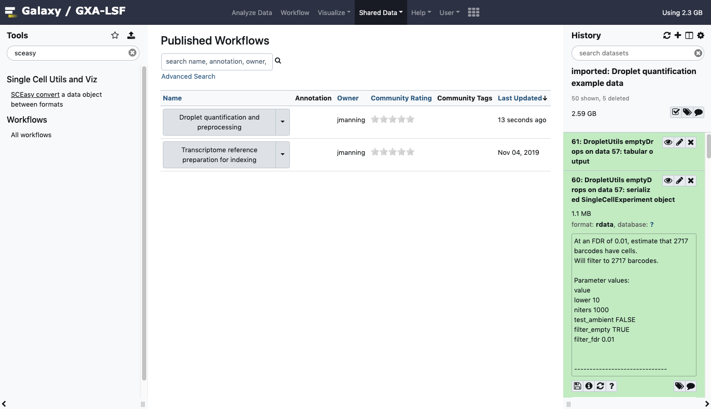

Click the dropdown next to the workflow to import it. Then go back, select the 'Workflow' tab and click on the workflow. This will open the workflow editor and you can overview what we did above:

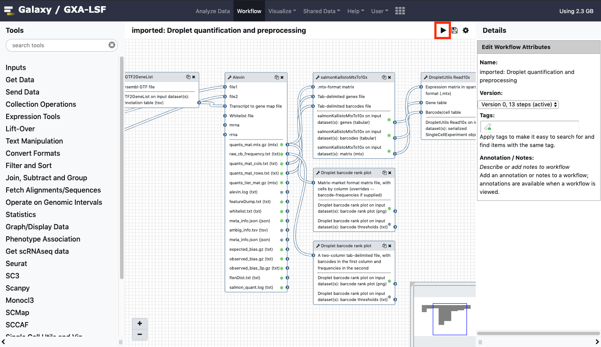

If you click the play icon you get an interface allowing you to execute the whole workflow. Try it out:

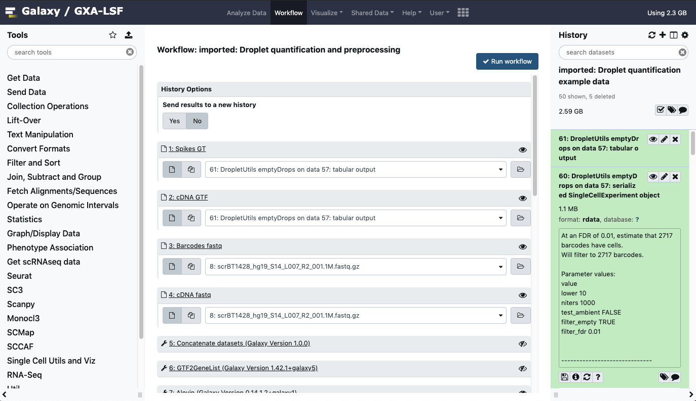

# 7. Summary

You've reached the end of this session. We have:

 * Taken raw read data and annotations and necessary input files for quantification.
 * Run Alevin in two different parameterisations, both allowing Alevin to make its own calls on what constitutes empty droplets, and applying emptyDrops instead.
 * Deployed barcode rank plots as a way of quickly assessing the signal present in droplet datasets. Further assessments of quality are the subject of subsequent sections of this course.
 * Applied the necessary conversion to pass these data to downstream processes.  
 * Run a workflow of all steps at once.

# References

 - Lun ATL, Riesenfeld S, Andrews T, et al. EmptyDrops: distinguishing cells from empty droplets in droplet-based single-cell RNA sequencing data. Genome Biol. 2019;20(1):63.
 - Melsted P, Ntranos V, Pachter L. The Barcode, UMI, Set format and BUStools. Bioinformatics. 2019;
 - Srivastava A, Malik L, Smith T, Sudbery I, Patro R. Alevin efficiently estimates accurate gene abundances from dscRNA-seq data. Genome Biol. 2019;20(1):65.
 - Zheng GX, Terry JM, Belgrader P, et al. Massively parallel digital transcriptional profiling of single cells. Nat Commun. 2017;8:14049.
