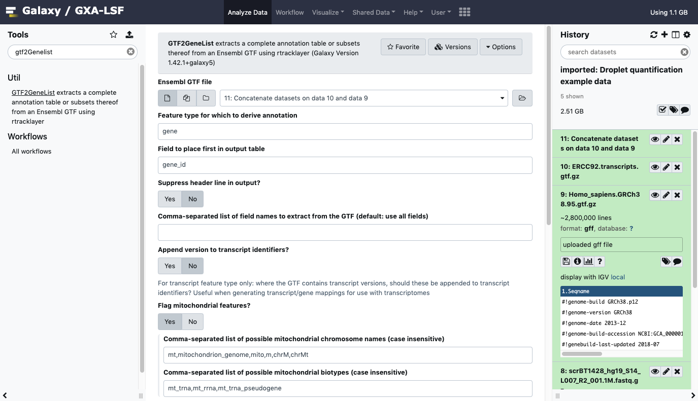

# Generating an expression matrix for droplet single-cell RNA-seq (dscRNA-seq) data

## Objectives

By the end of this short tutorial should you should understand:

 * how to generate an expression matrix from droplet-based single-cell transcriptomic data. 
 * how to do some basic quality control 
 * how to pass the matrix for downstream analysis

## You will need

 * A fastq file containing cell barcode and unique molecular identifiers (UMIs)
 * A matching fastq file containg biological sequences (cDNAs)
 * A reference transcriptome to map against
 * Necessary information to generate a transcript-to-gene mapping

We'll be using pre-prepared example inputs

# Introduction

This session will show you the principles of the initial phase of single-cell RNA-seq analysis: generating expression measures in a matrix. We'll concentrate on droplet-based (rather than plate-based) methodology, since this is the process with most differences with respect to conventional approaches developed for bulk RNA-seq.

Droplet-based data consists of three components: cell barcodes, unique molecular identifiers (UMIs) and cDNA reads. To generate cell-wise quantifications we need to:

 1. Process cell barcodes, working out which ones correspond to 'real' cells, which to sequencing artefacts, and possibly correct any barcodes likely to be the product of sequencing errors by comparison to more frequent sequences.
 2. Map biological sequences to the reference genome or transcriptome.
 3. 'De-duplicate' using the UMIs.

This used to be a complex process involving multiple algorithms, or was performed with technology-specific methods (such as 10X's 'Cellranger' tool)  but is now much simpler thanks to the advent of a few new methods. When selecting methodology for your own work you should consider:

 * [STARsolo](https://github.com/alexdobin/STAR) - a dscRNA-seq-specific variant of the popular genome alignment method STAR. Produces results very close to those of Cellranger (which itself uses STAR under the hood).
 * [Kallisto/ bustools](https://www.kallistobus.tools/) - developed by the originators of the transcripome quantification method, Kallisto.
 * [Alevin](https://salmon.readthedocs.io/en/latest/alevin.html) - another transcriptome method developed by the authors of the Salmon tool.

We're going to use Alevin for demonstration purposes, but we do not endorse one method over another.

We'll be using a setup based on Galaxy to illustrate the process for teaching purposes. The process is relatively simple given currently available tools, but there are some complexities we'll explain. 

## 1. Example data

We've provided you with some example data to play with, a small subset of the reads in a human dataset of lung carcinoma (see the study in Single Cell Expression Atlas [here](https://www.ebi.ac.uk/gxa/sc/experiments/E-MTAB-6653/results/tsne) and the project submission [here](https://www.ebi.ac.uk/arrayexpress/experiments/E-MTAB-6653/). This is a study using the 10X 'v2' chemistry.

Down-sampled reads and some associated annotation stored in what Galaxy calls a 'history'. Access the shared history:

 

If you click through to the history, you'll see that we've provided you with two 1 million-read FASTQ files and GTF files related to the gene annotations and to a set of spike-ins. You can then import the history to use yourself:

This is what the your history will look like:

> EXERCISE: Have a look at the files you now have in your history. Which of the FASTQ files do you think contains the barcode sequences? Given the chemistry this study should have, are the barcode/UMI reads the right length (hint: check https://teichlab.github.io/scg_lib_structs/methods_html/10xChromium3.html)

## 2. The workflow

Alevin collapses the steps involved in dealing with dscRNA-seq into a single process, so much of what we'll cover is 'plumbing' of intputs, and interpretation. 

### 1. Generate a transcriptome index

Normally, you would need to generate an index for your transcriptome of interest, containing all sequences likely to be present in your experiment's read data. Generating that index is too time-consuming to do as part of this sesssion, so we'll using using one we made earlier. But have a look at the fasta format sequences, which are the same as the ones we used to build the index. 

### 2. Generate a transcript to gene mapping

To generate gene-level quantifications based on transcriptome quantification, Alevin and similar tools require a conversion between transcript and gene identifiers, which we can derive from the annotations available in genome resources such as Ensembl. The transcripts in this list need to match the ones we used in the sequences reference. In your example data you will see 'Homo_sapiens.GRCh38.95.gtf.gz', which is the human reference annotations as retrieved from Ensembl in GTF format, and a transcript-level descritption of the ERCC spike-ins (also in GTF format). 

For this study our reference data contain biological and spike-in sequence data, so before we generate our mapping file we need to combine the respective sets of annotation, which we can do using a 'concatenate' tool found in Galaxy under 'Text Manipulation':

Select biological and technical sequences from your history, and use them as inputs. Run the tool and generate your combined annotations.
 
> EXERCISE: Which of the 'attributes' in the last column of the GTF files contains the transcript and gene identifiers?

Now we have combined annotations, we can parse the GTF file using the [rtracklayer](https://bioconductor.org/packages/release/bioc/html/rtracklayer.html) package in R. We've made a convenience tool in Galaxy to wrap that functionality for you- search for 'GTF2GeneList':

This tool is designed to do a variety of things. For our purposes parameterise like:

 * "Feature type..." : transcript
 * "Field to place first..." : (use the transcript ID field you identified above)
 * "Suppress header" : yes
 * "Comma separated list of field names" : (transcript ID field),(gene ID field)
 * "Append version to transcript identifiers" : yes 
 * "Flag mitochondrial features" : no
 * "Filter a FASTA": no

> EXERCISE: compare the transcript identifiers with the transcript ID values in the GTF, to see why we say 'yes' to the 'transcript identifiers' question

### 3. Running quantification

Now we have everything we need to run Alevin:

 * A Salmon index for our transcriptome
 * Barcode/ UMI reads
 * cDNA reads
 * transcript/ gene mapping

We can now run Alevin. Locate the tool by searching with the 'search tools' box. 

> EXERCISE: Using [Alevin's documentation](https://salmon.readthedocs.io/en/latest/alevin.html), what you know of the protocol used in this experiment (see above), and what you identified by examining the read files, set the options appropriately and run Alevin to produce a matrix market format (MTX) format output. Many options can be left unset.

